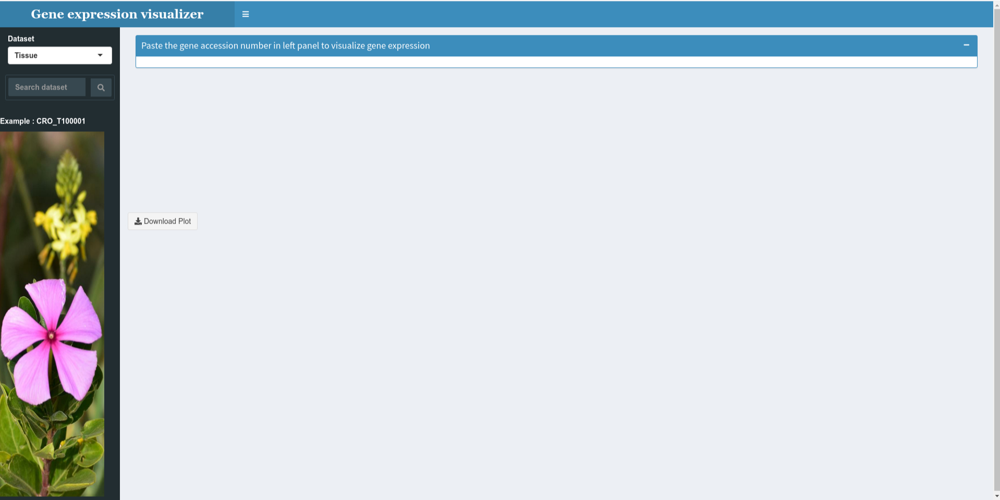

# Gene-Expression-Visualizer

Shiny app designed to extract the expression value from data table and make a bar plot. The data tables can be save in 'data' directory.

To run app, following packages are required

library(shiny)

library(shinydashboard)

library(reshape2)

library(ggplot2)

